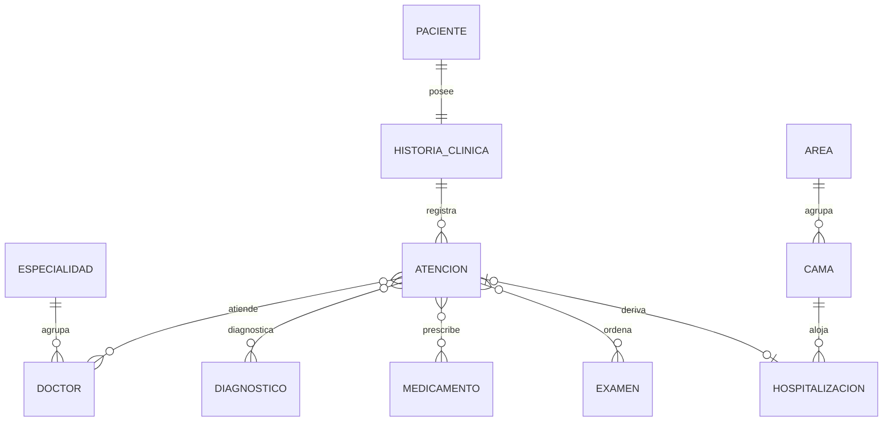
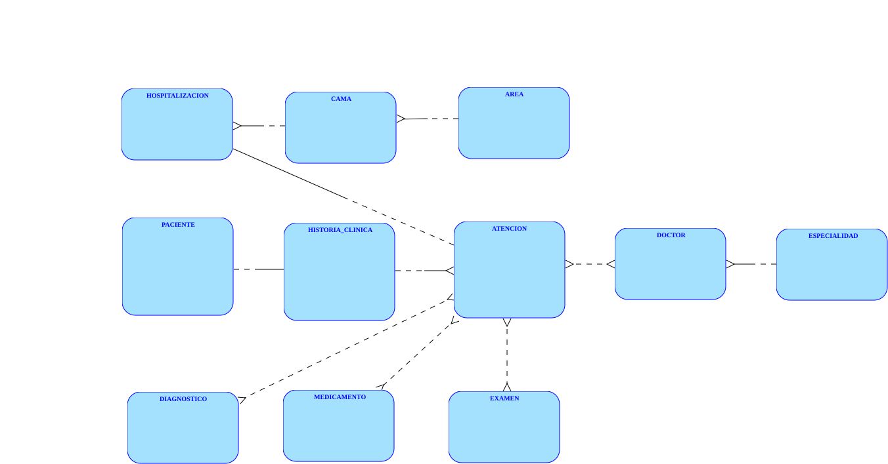
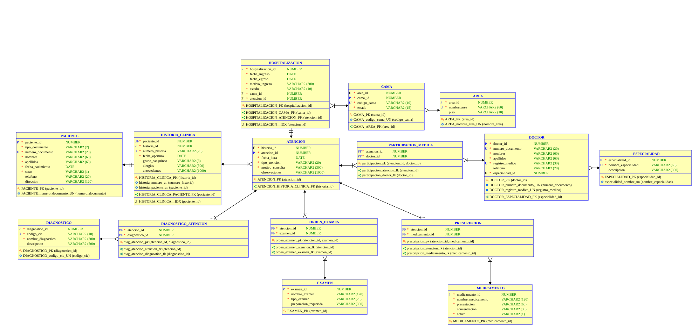

# Tema 1 — Sistema de gestión clínica-hospitalaria

## 1. Modelo conceptual

En este nivel solo se identifican las entidades, las relaciones entre ellas y su
cardinalidad, sin atributos, sin claves y sin resolver todavía las relaciones
muchos-a-muchos.

**Entidades identificadas:** Paciente, Historia_clinica, Atencion, Doctor,
Especialidad, Diagnostico, Medicamento, Examen, Hospitalizacion, Cama, Area.

- Paciente – Historia_clinica (posee): 1:1 — cada paciente tiene una única
  historia clínica y cada historia pertenece a un solo paciente.
- Historia_clinica – Atencion (registra): 1:N — una historia clínica acumula
  muchas atenciones a lo largo de los años; cada atención queda registrada en
  una sola historia.
- Especialidad – Doctor (agrupa): 1:N — una especialidad agrupa a muchos
  doctores; cada doctor ejerce una única especialidad.
- Atencion – Doctor (atiende): N:N — una atención puede involucrar a varios
  doctores y un doctor participa en muchas atenciones. Queda planteada así, sin
  resolver.
- Atencion – Diagnostico (diagnostica): N:N — en una atención se registran uno o
  varios diagnósticos y un mismo diagnóstico del catálogo aparece en muchas
  atenciones. Sin resolver.
- Atencion – Medicamento (prescribe): N:N — una atención prescribe varios
  medicamentos y un medicamento se prescribe en muchas atenciones. Sin resolver.
- Atencion – Examen (ordena): N:N — una atención ordena varios exámenes y un
  examen del catálogo se ordena en muchas atenciones. Sin resolver.
- Atencion – Hospitalizacion (deriva en): 1:1 — solo algunas atenciones derivan
  en hospitalización, y cada hospitalización proviene de una única atención.
- Cama – Hospitalizacion (aloja): 1:N — una cama aloja muchas hospitalizaciones
  a lo largo del tiempo; cada hospitalización ocupa una cama.
- Area – Cama (agrupa): 1:N — un área reúne muchas camas; cada cama pertenece a
  una sola área.

## 2. Modelo entidad-relacion

Se detalla el modelo conceptual incorporando los atributos propios de cada
entidad y la restricción que le aplica a cada uno. Las relaciones se listan
aparte, con su cardinalidad y su nombre.

### Entidades

**PACIENTE**
- `paciente_id`: PK
- `tipo_documento`: NN, C(CC, TI, CE, PA)
- `numero_documento`: U, NN
- `nombres`: NN
- `apellidos`: NN
- `fecha_nacimiento`: NN
- `sexo`: NN, C(M, F, O)
- `telefono`
- `direccion`

**HISTORIA_CLINICA**
- `historia_id`: PK
- `numero_historia`: U, NN
- `fecha_apertura`: NN
- `grupo_sanguineo`: C(A+, A-, B+, B-, AB+, AB-, O+, O-)
- `alergias`
- `antecedentes`

**ATENCION**
- `atencion_id`: PK
- `fecha_hora`: NN
- `tipo_atencion`: NN, C(urgencias, consulta_externa, control)
- `motivo_consulta`: NN
- `observaciones`

**DOCTOR**
- `doctor_id`: PK
- `numero_documento`: U, NN
- `nombres`: NN
- `apellidos`: NN
- `registro_medico`: U, NN
- `telefono`

**ESPECIALIDAD**
- `especialidad_id`: PK
- `nombre_especialidad`: U, NN
- `descripcion`

**DIAGNOSTICO**
- `diagnostico_id`: PK
- `codigo_cie`: U, NN
- `nombre_diagnostico`: NN
- `descripcion`

**MEDICAMENTO**
- `medicamento_id`: PK
- `nombre_medicamento`: NN
- `presentacion`: NN
- `concentracion`
- `activo`: NN, D=S, C(S, N)

**EXAMEN**
- `examen_id`: PK
- `nombre_examen`: NN
- `tipo_examen`: NN, C(laboratorio, imagenologia, procedimiento)
- `preparacion_requerida`

**HOSPITALIZACION**
- `hospitalizacion_id`: PK
- `fecha_ingreso`: NN
- `fecha_egreso`
- `motivo_ingreso`: NN
- `estado`: NN, D=activa, C(activa, egresada)

**AREA**
- `area_id`: PK
- `nombre_area`: U, NN
- `piso`

**CAMA**
- `cama_id`: PK
- `codigo_cama`: U, NN
- `estado`: NN, D=libre, C(libre, ocupada, mantenimiento)

### Relaciones

- Un Paciente posee una única Historia_clinica y una Historia_clinica pertenece
  a un único Paciente (posee) — 1:1.
- Una Historia_clinica registra muchas Atenciones; una Atencion pertenece a una
  única Historia_clinica (registra) — 1:N.
- Una Especialidad agrupa a muchos Doctores; un Doctor ejerce una única
  Especialidad (agrupa) — 1:N.
- Una Atencion es atendida por muchos Doctores y un Doctor participa en muchas
  Atenciones (atiende) — N:N.
- Una Atencion registra muchos Diagnosticos y un Diagnostico aparece en muchas
  Atenciones (diagnostica) — N:N.
- Una Atencion prescribe muchos Medicamentos y un Medicamento se prescribe en
  muchas Atenciones (prescribe) — N:N.
- Una Atencion ordena muchos Examenes y un Examen se ordena en muchas Atenciones
  (ordena) — N:N.
- Una Atencion deriva en una única Hospitalizacion y una Hospitalizacion proviene
  de una única Atencion (deriva) — 1:1.
- Una Cama aloja muchas Hospitalizaciones y una Hospitalizacion ocupa una única
  Cama (aloja) — 1:N.
- Un Area agrupa muchas Camas y una Cama pertenece a una única Area (agrupa) —
  1:N.

Nota: los atributos que materializan las relaciones (las futuras claves
foráneas, como `historia_id` dentro de Atencion o `especialidad_id` dentro de
Doctor) no se listan aquí como atributos propios de la entidad: aparecen solo
cuando se pasa al modelo lógico, en el siguiente nivel.

## 3. Modelo logico

Se traduce el modelo entidad-relación a tablas: cada entidad se convierte en una
tabla, cada relación 1:N se resuelve con una clave foránea en el lado "muchos",
las relaciones 1:1 se resuelven con una clave foránea que además lleva una
restricción de unicidad, y cada relación N:N se resuelve creando una tabla
intermedia con una clave primaria compuesta por las dos claves foráneas que
participan en ella. Cada tabla intermedia recibe un sustantivo del negocio que
describe lo que registra, en lugar del verbo de la relación que resuelve.

### PACIENTE

| Columna | Restricción | Descripción |
|---|---|---|
| `paciente_id` | PK | Identifica cada paciente. |
| `tipo_documento` | NN, C(CC, TI, CE, PA) | Tipo de documento de identidad. |
| `numero_documento` | U, NN | Documento de identidad; no se repite entre pacientes. |
| `nombres` | NN | Obligatorio. |
| `apellidos` | NN | Obligatorio. |
| `fecha_nacimiento` | NN | Permite calcular la edad en cada atención. |
| `sexo` | NN, C(M, F, O) | Obligatorio. |
| `telefono` | — | Atributo opcional. |
| `direccion` | — | Atributo opcional. |

### HISTORIA_CLINICA — 1:1 con PACIENTE

| Columna | Restricción | Descripción |
|---|---|---|
| `historia_id` | PK | Identifica cada historia clínica. |
| `numero_historia` | U, NN | Número visible que usa la institución. |
| `fecha_apertura` | NN | Fecha de apertura de la historia. |
| `grupo_sanguineo` | C(A+, A-, B+, B-, AB+, AB-, O+, O-) | Opcional; puede desconocerse. |
| `alergias` | — | Atributo opcional. |
| `antecedentes` | — | Atributo opcional. |
| `paciente_id` | FK, U, NN | Materializa la relación 1:1: el UNIQUE impide que un mismo paciente tenga más de una historia. |

### ATENCION

| Columna | Restricción | Descripción |
|---|---|---|
| `atencion_id` | PK | Identifica cada episodio de atención. |
| `fecha_hora` | NN | Momento de la atención; ordena el recorrido del paciente. |
| `tipo_atencion` | NN, C(urgencias, consulta_externa, control) | Obligatorio. |
| `motivo_consulta` | NN | Lo que refiere el paciente al llegar. |
| `observaciones` | — | Notas clínicas del episodio. |
| `historia_id` | FK, NN | Materializa la relación 1:N con HISTORIA_CLINICA; toda atención pertenece a una historia. |

### DOCTOR

| Columna | Restricción | Descripción |
|---|---|---|
| `doctor_id` | PK | Identifica cada doctor. |
| `numero_documento` | U, NN | Documento de identidad. |
| `nombres` | NN | Obligatorio. |
| `apellidos` | NN | Obligatorio. |
| `registro_medico` | U, NN | Matrícula profesional; no se repite. |
| `telefono` | — | Atributo opcional. |
| `especialidad_id` | FK, NN | Materializa la relación 1:N con ESPECIALIDAD. |

### ESPECIALIDAD

| Columna | Restricción | Descripción |
|---|---|---|
| `especialidad_id` | PK | Identifica cada especialidad. |
| `nombre_especialidad` | U, NN | No se repite en el catálogo. |
| `descripcion` | — | Atributo opcional. |

### DIAGNOSTICO

| Columna | Restricción | Descripción |
|---|---|---|
| `diagnostico_id` | PK | Identifica cada diagnóstico del catálogo. |
| `codigo_cie` | U, NN | Código de la clasificación internacional. |
| `nombre_diagnostico` | NN | Denominación oficial. |
| `descripcion` | — | Atributo opcional. |

### MEDICAMENTO

| Columna | Restricción | Descripción |
|---|---|---|
| `medicamento_id` | PK | Identifica cada medicamento del catálogo. |
| `nombre_medicamento` | NN | Principio activo o nombre comercial. |
| `presentacion` | NN | Tableta, jarabe, ampolla. |
| `concentracion` | — | Atributo opcional. |
| `activo` | NN, D=S, C(S, N) | Permite descontinuar un medicamento sin borrarlo del catálogo. |

### EXAMEN

| Columna | Restricción | Descripción |
|---|---|---|
| `examen_id` | PK | Identifica cada examen del catálogo. |
| `nombre_examen` | NN | Hemograma, radiografía de tórax. |
| `tipo_examen` | NN, C(laboratorio, imagenologia, procedimiento) | Obligatorio. |
| `preparacion_requerida` | — | Ayuno u otras indicaciones previas. |

### HOSPITALIZACION — 1:1 con ATENCION

| Columna | Restricción | Descripción |
|---|---|---|
| `hospitalizacion_id` | PK | Identifica cada hospitalización. |
| `fecha_ingreso` | NN | Obligatorio. |
| `fecha_egreso` | — | Vacía mientras el paciente sigue internado. |
| `motivo_ingreso` | NN | Justificación clínica de la internación. |
| `estado` | NN, D=activa, C(activa, egresada) | Evita depender de si la fecha de egreso está vacía. |
| `cama_id` | FK, NN | Materializa la relación 1:N con CAMA. |
| `atencion_id` | FK, U, NN | Materializa la relación 1:1: el UNIQUE impide que una atención genere dos hospitalizaciones. |

### AREA

| Columna | Restricción | Descripción |
|---|---|---|
| `area_id` | PK | Identifica cada área. |
| `nombre_area` | U, NN | UCI, pediatría, cirugía. |
| `piso` | — | Atributo opcional. |

### CAMA

| Columna | Restricción | Descripción |
|---|---|---|
| `cama_id` | PK | Identifica cada cama. |
| `codigo_cama` | U, NN | Rótulo físico de la cama. |
| `estado` | NN, D=libre, C(libre, ocupada, mantenimiento) | Obligatorio. |
| `area_id` | FK, NN | Materializa la relación 1:N con AREA. |

### PARTICIPACION_MEDICA — resuelve la relación N:N Atencion–Doctor (atiende)

| Columna | Restricción | Descripción |
|---|---|---|
| `atencion_id` | PK, FK | Referencia a ATENCION; parte de la clave compuesta. |
| `doctor_id` | PK, FK | Referencia a DOCTOR; parte de la clave compuesta. |

### DIAGNOSTICO_ATENCION — resuelve la relación N:N Atencion–Diagnostico (diagnostica)

| Columna | Restricción | Descripción |
|---|---|---|
| `atencion_id` | PK, FK | Referencia a ATENCION; parte de la clave compuesta. |
| `diagnostico_id` | PK, FK | Referencia a DIAGNOSTICO; parte de la clave compuesta. |

### PRESCRIPCION — resuelve la relación N:N Atencion–Medicamento (prescribe)

| Columna | Restricción | Descripción |
|---|---|---|
| `atencion_id` | PK, FK | Referencia a ATENCION; parte de la clave compuesta. |
| `medicamento_id` | PK, FK | Referencia a MEDICAMENTO; parte de la clave compuesta. |

### ORDEN_EXAMEN — resuelve la relación N:N Atencion–Examen (ordena)

| Columna | Restricción | Descripción |
|---|---|---|
| `atencion_id` | PK, FK | Referencia a ATENCION; parte de la clave compuesta. |
| `examen_id` | PK, FK | Referencia a EXAMEN; parte de la clave compuesta. |

El script generado por Oracle SQL Developer Data Modeler se encuentra en
`ddl/tema01.sql`, exportado sin errores ni advertencias.

### Decisiones de interpretación registradas para la justificación

- Las atenciones cuelgan de la historia clínica y no del paciente, para no
  duplicar el vínculo entre ambos.
- Diagnostico, Medicamento y Examen se modelan como catálogos referenciados, no
  como texto libre dentro de la atención.
- Atencion – Hospitalizacion se fijó en 1:1 para que la atención siga siendo el
  episodio que ancla el recorrido del paciente.
- `paciente_id` se prefirió sobre `numero_documento` como clave primaria de
  PACIENTE; lo mismo con `registro_medico` en DOCTOR.
- Las tablas intermedias llevan sustantivos del negocio en el nivel lógico,
  mientras las relaciones que resuelven conservan su nombre de verbo en los
  niveles conceptual y entidad-relación.
- Quedaron fuera del alcance las citas previas y los tratamientos como entidad
  propia.
