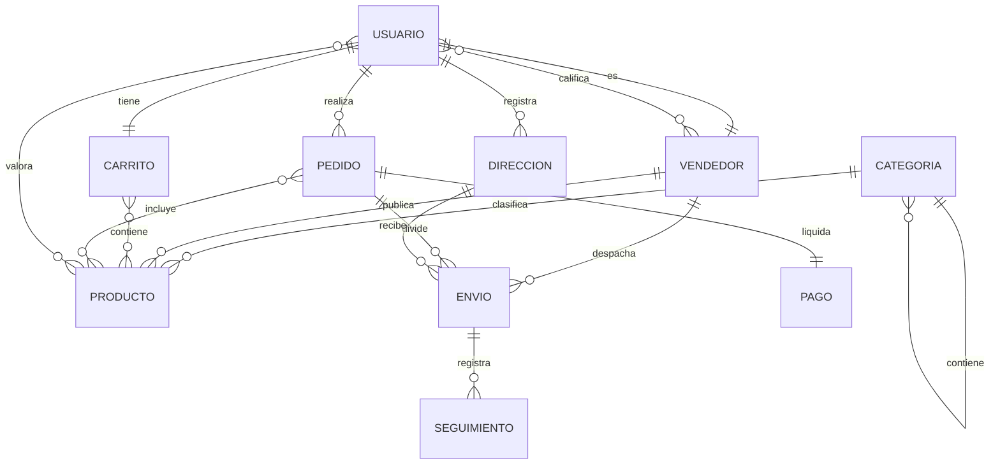
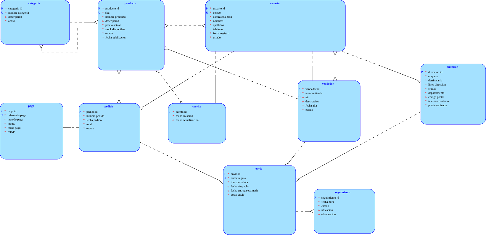
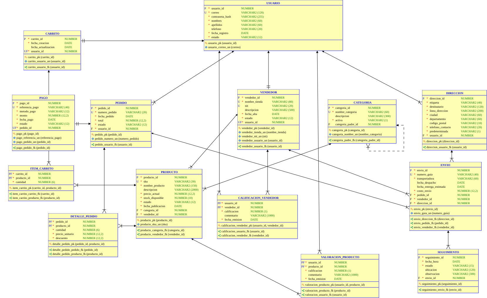

# Tema 2 — Plataforma de comercio electrónico (marketplace)

## 1. Modelo conceptual

En este nivel solo se identifican las entidades, las relaciones entre ellas y su
cardinalidad, sin atributos, sin claves y sin resolver todavía las relaciones
muchos-a-muchos.

**Entidades identificadas:** Usuario, Vendedor, Direccion, Categoria, Producto,
Carrito, Pedido, Pago, Envio, Seguimiento.

- Usuario – Vendedor (es): 1:1 — un usuario puede tener un perfil de vendedor, y
  cada perfil pertenece a un único usuario.
- Usuario – Carrito (tiene): 1:1 — cada usuario tiene un único carrito activo y
  cada carrito pertenece a un solo usuario.
- Usuario – Direccion (registra): 1:N — un usuario guarda varias direcciones de
  entrega; cada dirección pertenece a un solo usuario.
- Usuario – Pedido (realiza): 1:N — un usuario realiza muchos pedidos a lo largo
  del tiempo; cada pedido es de un único usuario.
- Categoria – Producto (clasifica): 1:N — una categoría agrupa muchos productos;
  cada producto pertenece a una sola categoría.
- Categoria – Categoria (contiene): 1:N recursiva — una categoría puede contener
  varias subcategorías, y cada categoría tiene como máximo una categoría padre.
- Vendedor – Producto (publica): 1:N — un vendedor publica muchos productos;
  cada producto es publicado por un único vendedor.
- Carrito – Producto (contiene): N:N — un carrito reúne varios productos y un
  producto está en muchos carritos. Queda planteada así, sin resolver.
- Pedido – Producto (incluye): N:N — un pedido incluye varios productos y un
  producto aparece en muchos pedidos. Sin resolver.
- Pedido – Pago (liquida): 1:1 — cada pedido se liquida con un único pago y cada
  pago corresponde a un solo pedido.
- Pedido – Envio (divide): 1:N — un pedido se divide en uno o varios envíos;
  cada envío pertenece a un solo pedido.
- Vendedor – Envio (despacha): 1:N — cada envío lo despacha un único vendedor;
  un vendedor despacha muchos envíos.
- Direccion – Envio (recibe): 1:N — cada envío se entrega en una dirección; una
  dirección recibe muchos envíos.
- Envio – Seguimiento (registra): 1:N — un envío acumula varios registros de
  seguimiento; cada registro pertenece a un solo envío.
- Usuario – Producto (valora): N:N — un usuario valora muchos productos y un
  producto recibe muchas valoraciones. Sin resolver.
- Usuario – Vendedor (califica): N:N — un usuario califica a muchos vendedores y
  un vendedor recibe muchas calificaciones. Sin resolver.

## 2. Modelo entidad-relacion

Se detalla el modelo conceptual incorporando los atributos propios de cada
entidad y la restricción que le aplica a cada uno. Las relaciones se listan
aparte, con su cardinalidad y su nombre.

### Entidades

**USUARIO**
- `usuario_id`: PK
- `correo`: U, NN
- `contrasena_hash`: NN
- `nombres`: NN
- `apellidos`: NN
- `telefono`
- `fecha_registro`: NN, D=SYSDATE
- `estado`: NN, D=activo, C(activo, suspendido, inactivo)

**VENDEDOR**
- `vendedor_id`: PK
- `nombre_tienda`: U, NN
- `nit`: U
- `descripcion`
- `fecha_alta`: NN, D=SYSDATE
- `estado`: NN, D=activo, C(activo, suspendido)

**DIRECCION**
- `direccion_id`: PK
- `etiqueta`: NN
- `destinatario`: NN
- `linea_direccion`: NN
- `ciudad`: NN
- `departamento`: NN
- `codigo_postal`
- `telefono_contacto`: NN
- `predeterminada`: NN, D=N, C(S, N)

**CATEGORIA**
- `categoria_id`: PK
- `nombre_categoria`: U, NN
- `descripcion`
- `activa`: NN, D=S, C(S, N)

**PRODUCTO**
- `producto_id`: PK
- `sku`: U, NN
- `nombre_producto`: NN
- `descripcion`
- `precio_actual`: NN, C(> 0)
- `stock_disponible`: NN, D=0, C(>= 0)
- `estado`: NN, D=borrador, C(borrador, publicado, agotado, retirado)
- `fecha_publicacion`: NN, D=SYSDATE

**CARRITO**
- `carrito_id`: PK
- `fecha_creacion`: NN, D=SYSDATE
- `fecha_actualizacion`

**PEDIDO**
- `pedido_id`: PK
- `numero_pedido`: U, NN
- `fecha_pedido`: NN, D=SYSDATE
- `total`: NN, C(>= 0)
- `estado`: NN, D=pendiente, C(pendiente, pagado, enviado, entregado, cancelado)

**PAGO**
- `pago_id`: PK
- `referencia_pago`: U, NN
- `metodo_pago`: NN, C(tarjeta, pse, efectivo, billetera)
- `monto`: NN, C(> 0)
- `fecha_pago`: NN, D=SYSDATE
- `estado`: NN, D=pendiente, C(pendiente, aprobado, rechazado, reembolsado)

**ENVIO**
- `envio_id`: PK
- `numero_guia`: U, NN
- `transportadora`: NN
- `fecha_despacho`
- `fecha_entrega_estimada`
- `costo_envio`: NN, D=0, C(>= 0)

**SEGUIMIENTO**
- `seguimiento_id`: PK
- `fecha_hora`: NN, D=SYSDATE
- `estado`: NN, C(en_preparacion, en_transito, en_reparto, entregado, devuelto)
- `ubicacion`
- `observacion`

### Relaciones

- Un Usuario tiene un único perfil de Vendedor y un Vendedor pertenece a un
  único Usuario (es) — 1:1.
- Un Usuario tiene un único Carrito y un Carrito pertenece a un único Usuario
  (tiene) — 1:1.
- Un Usuario registra muchas Direcciones; una Direccion pertenece a un único
  Usuario (registra) — 1:N.
- Un Usuario realiza muchos Pedidos; un Pedido es de un único Usuario (realiza)
  — 1:N.
- Una Categoria clasifica muchos Productos; un Producto pertenece a una única
  Categoria (clasifica) — 1:N.
- Una Categoria contiene muchas subcategorías; cada Categoria tiene como máximo
  una categoría padre (contiene) — 1:N recursiva.
- Un Vendedor publica muchos Productos; un Producto es publicado por un único
  Vendedor (publica) — 1:N.
- Un Carrito contiene muchos Productos y un Producto está en muchos Carritos
  (contiene) — N:N.
- Un Pedido incluye muchos Productos y un Producto aparece en muchos Pedidos
  (incluye) — N:N.
- Un Pedido se liquida con un único Pago y un Pago corresponde a un único Pedido
  (liquida) — 1:1.
- Un Pedido se divide en muchos Envios; un Envio pertenece a un único Pedido
  (divide) — 1:N.
- Un Vendedor despacha muchos Envios; un Envio lo despacha un único Vendedor
  (despacha) — 1:N.
- Una Direccion recibe muchos Envios; un Envio se entrega en una única Direccion
  (recibe) — 1:N.
- Un Envio registra muchos Seguimientos; un Seguimiento pertenece a un único
  Envio (registra) — 1:N.
- Un Usuario valora muchos Productos y un Producto recibe valoraciones de muchos
  Usuarios (valora) — N:N.
- Un Usuario califica a muchos Vendedores y un Vendedor recibe calificaciones de
  muchos Usuarios (califica) — N:N.

Nota: los atributos que materializan las relaciones (las futuras claves
foráneas, como `categoria_id` dentro de Producto o `pedido_id` dentro de Envio)
no se listan aquí como atributos propios de la entidad: aparecen cuando se pasa
al modelo lógico. Lo mismo ocurre con los atributos propios de las relaciones
N:N: la cantidad en el carrito, la cantidad y el precio unitario congelado en el
pedido, y la calificación con su comentario en las dos valoraciones.

## 3. Modelo logico

Se traduce el modelo entidad-relación a tablas: cada entidad se convierte en una
tabla, cada relación 1:N se resuelve con una clave foránea en el lado "muchos",
las relaciones 1:1 se resuelven con una clave foránea que además lleva una
restricción de unicidad, y cada relación N:N se resuelve creando una tabla
intermedia con una clave primaria compuesta por las dos claves foráneas que
participan en ella.

### USUARIO

| Columna | Restricción | Descripción |
|---|---|---|
| `usuario_id` | PK | Identifica cada usuario. |
| `correo` | U, NN | Credencial de acceso; no se repite. |
| `contrasena_hash` | NN | Resumen criptográfico de la contraseña. |
| `nombres` | NN | Obligatorio. |
| `apellidos` | NN | Obligatorio. |
| `telefono` | — | Atributo opcional. |
| `fecha_registro` | NN, D=SYSDATE | Fecha de alta en la plataforma. |
| `estado` | NN, D=activo, C(activo, inactivo, suspendido) | Permite suspender sin borrar. |

### VENDEDOR — 1:1 con USUARIO

| Columna | Restricción | Descripción |
|---|---|---|
| `vendedor_id` | PK | Identifica cada perfil de vendedor. |
| `nombre_tienda` | U, NN | Nombre público de la tienda. |
| `nit` | U | Identificación tributaria; opcional para vendedores naturales. |
| `descripcion` | — | Atributo opcional. |
| `fecha_alta` | NN, D=SYSDATE | |
| `estado` | NN, D=activo, C(activo, suspendido) | |
| `usuario_id` | FK, U, NN | Materializa la 1:1: el UNIQUE impide dos perfiles de vendedor para un mismo usuario. |

### DIRECCION

| Columna | Restricción | Descripción |
|---|---|---|
| `direccion_id` | PK | Identifica cada dirección. |
| `etiqueta` | NN | Casa, oficina. |
| `destinatario` | NN | Quien recibe; puede no ser el titular. |
| `linea_direccion` | NN | |
| `ciudad` | NN | |
| `departamento` | NN | |
| `codigo_postal` | — | Atributo opcional. |
| `telefono_contacto` | NN | Requerido por la transportadora. |
| `predeterminada` | NN, D=N, C(S, N) | Marca la dirección por defecto. |
| `usuario_id` | FK, NN | Materializa la relación 1:N con USUARIO. |

### CATEGORIA

| Columna | Restricción | Descripción |
|---|---|---|
| `categoria_id` | PK | Identifica cada categoría. |
| `nombre_categoria` | U, NN | No se repite en el catálogo. |
| `descripcion` | — | Atributo opcional. |
| `activa` | NN, D=S, C(S, N) | Permite retirar una categoría sin borrarla. |
| `categoria_padre_id` | FK | Materializa la relación recursiva: referencia a `categoria_id` de la misma tabla. Vacía en las categorías raíz. |

### PRODUCTO

| Columna | Restricción | Descripción |
|---|---|---|
| `producto_id` | PK | Identifica cada producto. |
| `sku` | U, NN | Código interno del producto. |
| `nombre_producto` | NN | |
| `descripcion` | — | Atributo opcional. |
| `precio_actual` | NN, C(> 0) | Precio vigente del catálogo; cambia con el tiempo. |
| `stock_disponible` | NN, D=0, C(>= 0) | Inventario del vendedor para ese producto. |
| `estado` | NN, D=borrador, C(borrador, publicado, agotado, retirado) | |
| `fecha_publicacion` | NN, D=SYSDATE | |
| `categoria_id` | FK, NN | Materializa la relación 1:N con CATEGORIA. |
| `vendedor_id` | FK, NN | Materializa la relación 1:N con VENDEDOR. |

### CARRITO — 1:1 con USUARIO

| Columna | Restricción | Descripción |
|---|---|---|
| `carrito_id` | PK | Identifica cada carrito. |
| `fecha_creacion` | NN, D=SYSDATE | |
| `fecha_actualizacion` | — | Último movimiento del carrito. |
| `usuario_id` | FK, U, NN | Materializa la 1:1: el UNIQUE impide dos carritos activos por usuario. |

### PEDIDO

| Columna | Restricción | Descripción |
|---|---|---|
| `pedido_id` | PK | Identifica cada pedido. |
| `numero_pedido` | U, NN | Número visible para el comprador. |
| `fecha_pedido` | NN, D=SYSDATE | |
| `total` | NN, C(>= 0) | Valor total liquidado; se conserva aunque los precios cambien. |
| `estado` | NN, D=pendiente, C(pendiente, pagado, enviado, entregado, cancelado) | |
| `usuario_id` | FK, NN | Materializa la relación 1:N con USUARIO. |

### PAGO — 1:1 con PEDIDO

| Columna | Restricción | Descripción |
|---|---|---|
| `pago_id` | PK | Identifica cada pago. |
| `referencia_pago` | U, NN | Referencia de la pasarela. |
| `metodo_pago` | NN, C(tarjeta, pse, efectivo, billetera) | |
| `monto` | NN, C(> 0) | |
| `fecha_pago` | NN, D=SYSDATE | |
| `estado` | NN, D=pendiente, C(pendiente, aprobado, rechazado, reembolsado) | Soporta devoluciones. |
| `pedido_id` | FK, U, NN | Materializa la 1:1: el UNIQUE impide dos pagos para el mismo pedido. |

### ENVIO

| Columna | Restricción | Descripción |
|---|---|---|
| `envio_id` | PK | Identifica cada envío. |
| `numero_guia` | U, NN | Guía de la transportadora. |
| `transportadora` | NN | |
| `fecha_despacho` | — | Vacía hasta que el vendedor despacha. |
| `fecha_entrega_estimada` | — | Atributo opcional. |
| `costo_envio` | NN, D=0, C(>= 0) | |
| `pedido_id` | FK, NN | Materializa la 1:N con PEDIDO; un pedido se divide en varios envíos. |
| `vendedor_id` | FK, NN | Materializa la 1:N con VENDEDOR; cada envío lo despacha un vendedor. |
| `direccion_id` | FK, NN | Materializa la 1:N con DIRECCION. |

### SEGUIMIENTO

| Columna | Restricción | Descripción |
|---|---|---|
| `seguimiento_id` | PK | Identifica cada registro de seguimiento. |
| `fecha_hora` | NN, D=SYSDATE | Momento del registro; ordena el recorrido. |
| `estado` | NN, C(en_preparacion, en_transito, en_reparto, entregado, devuelto) | |
| `ubicacion` | — | Atributo opcional. |
| `observacion` | — | Atributo opcional. |
| `envio_id` | FK, NN | Materializa la relación 1:N con ENVIO. |

### ITEM_CARRITO — resuelve la relación N:N Carrito–Producto

| Columna | Restricción | Descripción |
|---|---|---|
| `carrito_id` | PK, FK | Referencia a CARRITO; parte de la clave compuesta. |
| `producto_id` | PK, FK | Referencia a PRODUCTO; parte de la clave compuesta. |
| `cantidad` | NN, D=1, C(> 0) | Atributo propio de la línea del carrito. |

### DETALLE_PEDIDO — resuelve la relación N:N Pedido–Producto

| Columna | Restricción | Descripción |
|---|---|---|
| `pedido_id` | PK, FK | Referencia a PEDIDO; parte de la clave compuesta. |
| `producto_id` | PK, FK | Referencia a PRODUCTO; parte de la clave compuesta. |
| `cantidad` | NN, C(> 0) | |
| `precio_unitario` | NN, C(> 0) | Precio congelado al momento de la compra; no cambia si el catálogo cambia. |
| `descuento` | NN, D=0, C(>= 0) | Promoción aplicada en esa compra. |

### VALORACION_PRODUCTO — resuelve la relación N:N Usuario–Producto

| Columna | Restricción | Descripción |
|---|---|---|
| `usuario_id` | PK, FK | Referencia a USUARIO; parte de la clave compuesta. |
| `producto_id` | PK, FK | Referencia a PRODUCTO; la clave compuesta impide valorar dos veces el mismo producto. |
| `calificacion` | NN, C(entre 1 y 5) | |
| `comentario` | — | Atributo opcional. |
| `fecha_emision` | NN, D=SYSDATE | |

### CALIFICACION_VENDEDOR — resuelve la relación N:N Usuario–Vendedor

| Columna | Restricción | Descripción |
|---|---|---|
| `usuario_id` | PK, FK | Referencia a USUARIO; parte de la clave compuesta. |
| `vendedor_id` | PK, FK | Referencia a VENDEDOR; parte de la clave compuesta. |
| `calificacion` | NN, C(entre 1 y 5) | |
| `comentario` | — | Atributo opcional. |
| `fecha_emision` | NN, D=SYSDATE | |

El script correspondiente se encuentra en `ddl/tema02.sql`, importado en Oracle
SQL Developer Data Modeler y exportado sin errores ni advertencias.

### Decisiones de interpretación registradas para la justificación

- El precio se almacena dos veces a propósito: `precio_actual` en PRODUCTO como
  valor vigente del catálogo, y `precio_unitario` en DETALLE_PEDIDO como valor
  congelado al momento de la compra.
- Cada producto pertenece a un único vendedor, en lugar de un catálogo común con
  ofertas por vendedor.
- Los estados del envío se registran en una bitácora de seguimiento, no como un
  atributo de ENVIO.
- El pedido se divide en envíos por vendedor, consecuencia de que un pedido
  puede reunir productos de varios vendedores.
- `total` en PEDIDO se almacena pese a ser calculable, para congelar el valor
  efectivamente cobrado.
- Un solo Usuario con perfil opcional de Vendedor, en lugar de comprador y
  vendedor como entidades separadas.
